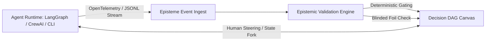

# RFC 001: Episteme — Human-Agent Epistemic Steering & Telemetry Canvas

- **Author**: Alexander Katin
- **Status**: Proposal / Architecture Blueprint
- **Target Audience**: AI Systems Engineers, Design Engineers, Multi-Agent Framework Authors (LangGraph, CrewAI, AutoGen, OpenTelemetry)

---

## 1. Executive Summary

As artificial intelligence systems transition from single-turn chat interfaces to non-deterministic, long-running multi-agent loops, current developer tooling suffers from a critical design and operational deficit:
1. **The "Observability vs. Steerability" Gap**: Platforms like LangSmith, Phoenix, and Arize provide passive post-mortem log tables and nested spans. They explain *what happened after failure*, but do not allow humans to *intervene, steer, or prune reasoning trajectories while in flight*.
2. **The "Apophenia Blindspot"**: Agentic systems hallucinate confidence. Current tools report self-assessed probabilities without deterministic statistical gating or blinded referee controls.

**Episteme** is an open-source, framework-agnostic interactive canvas for **human-agent trajectory inspection, epistemic confidence auditing, and real-time steerability**.

---

## 2. Core Architectural Primitives

### Primitive 1: The Branching Decision DAG
Rather than rendering linear trace logs, Episteme models agent execution as a dynamic **Directed Acyclic Graph (DAG)** of epistemic states:
- **Hypothesis Nodes**: The agent's proposed plan or sub-goal.
- **Action/Tool Nodes**: Concrete external mutations (file edits, API calls, shell executions).
- **Observation Nodes**: Environment responses.
- **Epistemic Gate Nodes**: Mathematical or statistical checkpoints (e.g. unicity distance, syntax permutations, test suite status) evaluated before progression.

### Primitive 2: The Epistemic Confidence & Blinding Lens
Directly adopting the scientific methodology of `cipher-lab`:
- **Double-Blind Refereeing with Foils**: When an agent uses an LLM judge to evaluate candidate outputs, Episteme injects negative-control decoys (foils). If the judge endorses a foil, Episteme flags the step with an **Apophenic Failure Alert** on the canvas.
- **Family-Wise Error Rate (FWER) Ledger**: Tracks the total denominator of exploratory branches, applying Bonferroni / Benjamini-Hochberg corrections to prevent false discovery from massive parallel trials.

### Primitive 3: Tactile Human Steerability (Time-Travel & Forking)
- **Scrub & Rewind**: The human operator can scrub backwards through the execution timeline.
- **Constraint Injection**: Click any intermediate node to inject a hard constraint (e.g. *"Do not modify `pyproject.toml`"* or *"Reject transposition key X"*).
- **Branch Forking**: Fork an alternative reasoning path with adjusted hyperparameters while preserving the original run in an append-only DuckDB session ledger.

---

## 3. Technology Stack & Integration Surface

| Layer | Technology | Rationale |
|---|---|---|
| **Canvas Viewport** | Svelte / React + HTML5 Canvas / SVG (d3-hierarchy / PixiJS) | High frame-rate smooth panning, tactile spring physics, lightweight bundle size |
| **Ingestion Protocol** | OpenTelemetry AI Semantic Conventions + WebSockets / SSE | Frictionless drop-in for LangGraph, LlamaIndex, LiteLLM, or custom Python agents |
| **Local State Store** | DuckDB (via WASM or local backend) | Embedded analytical queries over tens of thousands of agent decision trials |
| **Styling & Interaction** | Editorial / Modernist UI (Swiss craft, Inter + IBM Plex Mono, dark canvas) | High readability, information density, zero SaaS visual clutters |

---

## 4. Open-Source Distribution Strategy

1. **Standalone NPM Component (`@episteme/canvas`)**: Zero-config drop-in React/Svelte component that accepts an OpenTelemetry trace or JSONL stream URL.
2. **Python Wrapper (`pip install episteme-agent`)**: A two-line middleware that hooks into `logging` or agent loops to serve the local canvas on `http://localhost:4040`.
3. **Showcase Demo**: A live, interactive web demo loaded with real, complex multi-agent traces (e.g. the 120-test distributed cryptographic solving runs from `cipher-lab`).
